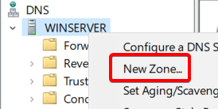

# DNS Server einrichten in Windows

### Windows Server 2019 Englisch installieren

1. Custom
2. Workstation 16.2.x
3. I will install the operating system later
4. Microsoft Windows, Windows Server 2019
5. C:\VirtualMachines\Modul123\WindowsServer
6. UEFI
7. 2 Prozessor, 2 Cores
8. 4 GiB RAM
9. NAT
10. LSI Logic SAS
11. NVMe
12. Create Virtual Disk
13. 60 GB, single file
14. WindowsServer.vmdk
15. Windows Server CD hinzufügen

### Normale Windows Server installation

1. Language: English
2. Time and Currency Format: Swiss German
3. Keyboard Layout: US-International
4. I don't have a product key
5. Windows Server 2019 Standard (Desktop Experience)
6. Accept License Agreement
7. Custom
8. Ganze Disk auswählen
9. Nachdem Restart solltest du jetzt ein Passwort eingeben, in meinem Fall: Arlind123!

### DHCP Server einrichten in Windows Server

1. VMware Tools installieren, wie in Windows 10 und neustarten.

#### Fixe IP Verteilen und Hostnamen angeben.
2. Fixe IP in Adapter Optionen einstellen
  - 192.168.100.4
  - 255.255.255.0
  - kein Gateway
  - 192.168.100.4
  - 8.8.8.8

3. In "View Advanced system settings" den Hostnamen einsellen: in meinem Fall WinServer

### DNS Rolle am Windows Server vergeben
1. Im Server Manager müssen wir "2. add roles and features" anklicken.  

2. Next
3. Role Based isntallation
4. Next
5. DNS Auswählen  

6. Add Features
7. 3x Next
8. Install
9. Sobald der Download fertig ist wählen wir "Close"

#### DNS Server Konfigurieren 1
1. Sobald wir dies haben gehen wir in Server Manager in "Tools" und nach DNS  

2. Und führe einen rechtsklick auf deinen Windows Server aus  

3. Primary Zone
4. Forward lookup zone
5. Nenne es etwas cooles, z.B. sulejmani.local
6. Do not allow dynamic updates

### Linux
1. Starte jetzt deinen Linux DHCP Server
2. `sudo nano /etc/netplan/01-netcfg.yaml`

3. mit `resolvectl status` solltest du jetzt deine momentane DNS Server sehen
4. `sudo nano /etc/dhcp/dhcpd.conf`  

### DNS Server Konfigurieren 2
1. Im DNS Manager erstelle jetzt einen DNS A Record für deinen Windows Server und deinen Ubuntu Server  

2. Und teste es, indem man sich gegenseitig pingt   Windows Server: `ping ubuntu.sulejmani.local`   Linux: `ping winserver.sulejmani.local`
3. Im Windows Server muss man, aber noch die Firewall deaktivieren.
4. Damit dies bei mir in Linux funktioniert musste ich diese 2 Commands durchführen  
`sudo rm -f /etc/resolv.conf`   `sudo ln -s /run/systemd/resolve/resolv.conf /etc/resolv.conf`
