# DNS Server einrichten in Windows
###### Diese Anleitung wird nur funktionieren, wenn sie [diese Doku](../praktisch1/README.md) schon durchgeführt haben.

### Windows Server 2019 Englisch installieren

1. Custom
2. Workstation 16.2.x
3. I will install the operating system later
4. Microsoft Windows, Windows Server 2019
5. C:\VirtualMachines\Modul123\WindowsServer
6. UEFI
7. 2 Prozessor, 2 Cores
8. 4 GiB RAM
9. NAT
10. LSI Logic SAS
11. NVMe
12. Create Virtual Disk
13. 60 GB, single file
14. WindowsServer.vmdk
15. Windows Server CD hinzufügen
16. Noch einen NIC hinzufügen, auf diesem wird der DNS Server laufen.

### Normale Windows Server installation

1. Language: English
2. Time and Currency Format: Swiss German
3. Keyboard Layout: US-International
4. I don't have a product key
5. Windows Server 2019 Standard (Desktop Experience)
6. Accept License Agreement
7. Custom
8. Ganze Disk auswählen
9. Nachdem Restart solltest du jetzt ein "sicheres" Passwort eingeben, in meinem Fall: Arlind123!
10. Jetzt können wir unseren NAT Adapter entfernen

### DHCP Server einrichten in Windows Server

1. VMware Tools installieren, wie in Windows 10 und neustarten. Unter VM > Install VMware Tools und der Anleitung auf deinem Bildschirm folgen.

#### Fixe IP Verteilen und Hostnamen angeben.
2. Fixe IP in Adapter Optionen einstellen
  - 192.168.100.4
  - 255.255.255.0
  - kein Gateway
  - 192.168.100.4
  - 8.8.8.8
Hier müssen wir dem Server eine Fixe IP-Adresse vergeben, die in einer Range ist mit dem anderen Clients. Wichtig ist auch, dass man sich selbst als DNS Server angibt.

3. In "View Advanced system settings" > Hostname den Hostnamen einsellen: in meinem Fall WinServer.
 
4. Und Sobald man all diese 3 Schritte erledigt hat sollte man neustarten.

### DNS Rolle am Windows Server vergeben
1. Im Server Manager müssen wir "2. add roles and features" anklicken.  
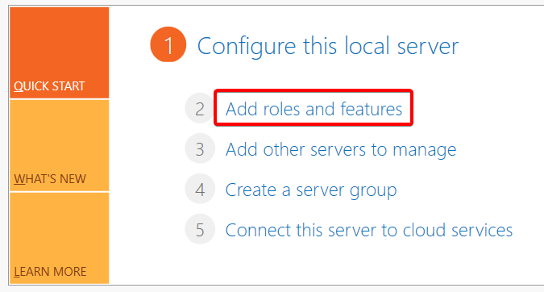
2. Next
3. Role Based installation
4. Next
5. DNS Auswählen  
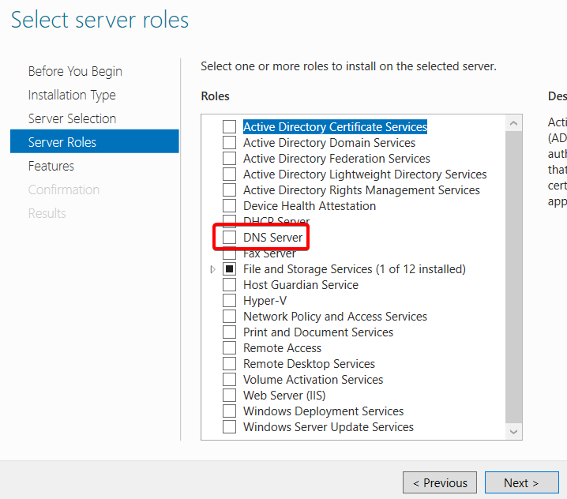
6. Add Features
7. 3x Next
8. Install
9. Sobald der Download fertig ist wählen wir "Close"

#### DNS Server Konfigurieren 1
1. Sobald wir dies haben gehen wir in Server Manager in "Tools" und nach DNS  
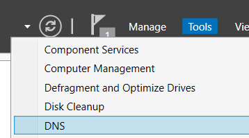
2. Wir führen einen rechtsklick auf deinen Windows Server aus und erstellen ein "Configure a DNS Server" 
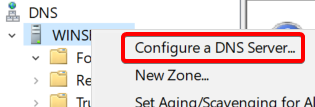
3. Next
4. "Create a forward and reverse lookup zone"
Forward lookup zones wandelen Domains zu IP-Adressen um.  
Reverse lookup zones wandelen IP-Adressen zu Domains um.  
In unserem Fall möchten wir beide.
5. "Yes, create a forward lookup zone now"
6. Primary Zone
7. Nenne es etwas cooles, z.B. sulejmani.local
8. Create a new file with this filename
9. allow both non secure and secure dynamic updates  
Ausser du hast ein Active Directory, dann wähle die sichere variante.
10. "Yes, create a reverse lookup zone now"
11. Primary Zone
12. IPv4
13. Network ID `192.168.100.`  
Der Reverse lookup name sollte etwas wie 100.168.192 sein, unsere Netzwerk ID _reversed_
14. "Create a new file with file name"
15. "allow both non secure and secure dynamic updates"
16. "no, it should not forward queries"
17. finish   
### Linux
1. Starte jetzt deinen Linux DHCP Server
2. In unsere netcfg Datei, müssen wir unseren DNS angeben. `sudo nano /etc/netplan/01-netcfg.yaml`  
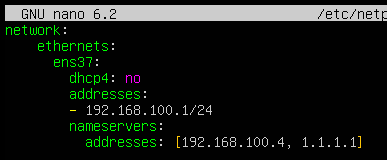
1. Mit `resolvectl status` solltest du jetzt deine momentane DNS Server sehen.
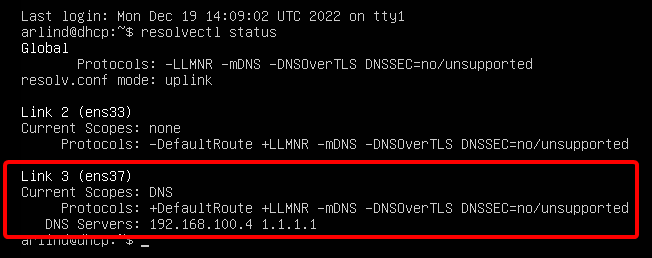
1. Jetzt können wir unseren DHCP editieren mit `sudo nano /etc/dhcp/dhcpd.conf` und dort unsere DNS Server angeben mit `option domain-name-servers 192,168.100.4;` Ich habe auch den Cloudflare DNS angegeben, aber dies hab ich nur gemacht, um zu zeigen, dass man mehrere DNS Server angeben kann. 
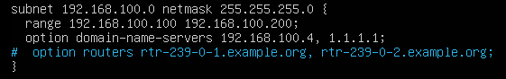
### DNS Server Konfigurieren 2
1. Im DNS Mangager unter Winserver > Forward Lookup Zone > sulejmani.local können wir jetzt unsere A-Records einstellen.
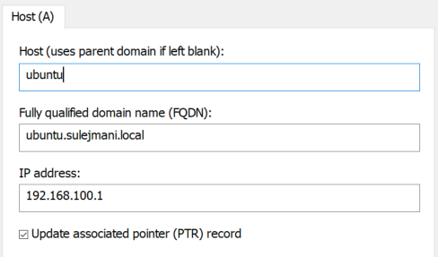
2. Unter DNS Mangager unter Winserver > Reverse Lookup Zone > 100.168.192.in.addr.arpa sollte es jetzt diese 3 Einträge auch finden.
3. Und teste es, indem man sich gegenseitig pingt   Windows Server: `ping ubuntu.sulejmani.local`   Linux: `ping winserver.sulejmani.local`
4. Im Windows Server muss man, aber noch die Firewall deaktivieren.
5. Damit dies bei mir in Linux funktioniert musste ich diese 2 Commands durchführen  
`sudo rm -f /etc/resolv.conf`   `sudo ln -s /run/systemd/resolve/resolv.conf /etc/resolv.conf`

### Testen
#### Ping
##### Windows Client zu Ubuntu Server und Windows Server
1. Linux Server: `ping ubuntu.sulejmani.local`
2. Windows Server: `ping winserver.sulejmani.local`  
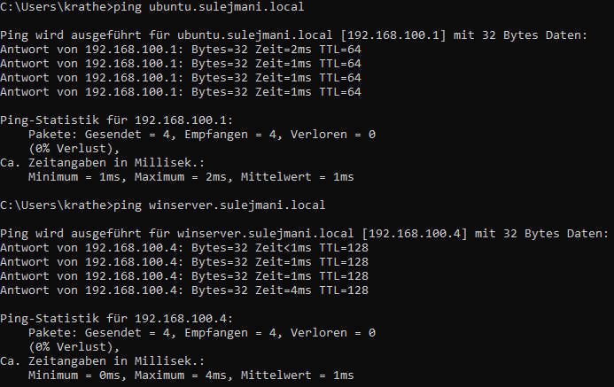

##### Windows Server zu Ubuntu Server und Windows Client
1. Windows Client: `ping PC-02.sulejmani.local`
2. Ubuntu Server: `ping ubuntu.sulejmani.local`  
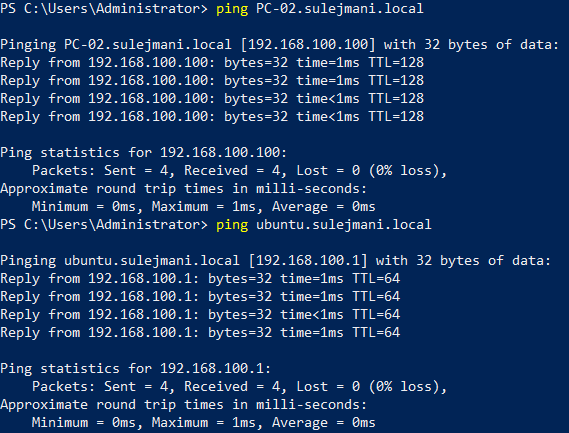

##### Ubuntu Server zu Windows Server und Windows Client
1. Windows Client: `ping PC-02.sulejmani.local`
2. Windows Server: `ping winserver.sulejmani.local`  
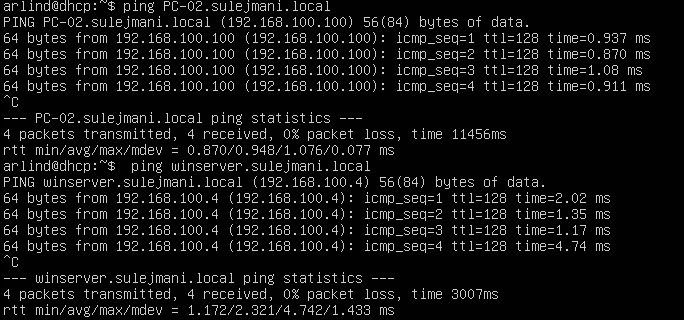

#### nslookup

##### Windows Client zu Ubuntu Server und Windows Server
1. root domain: `nslookup sulejmani.local`
2. Linux Server: `nslookup ubuntu.sulejmani.local`
3. Windows Server: `nslookup winserver.sulejmani.local`  
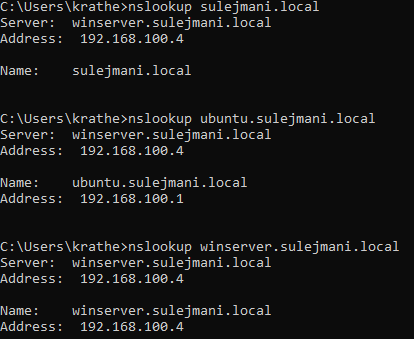

##### Windows Server zu Ubuntu Server und Windows Client
1. root domain: `nslookup sulejmani.local`
2. Windows Client: `nslookup PC-02.sulejmani.local`
3. Ubuntu Server: `nslookup ubuntu.sulejmani.local`  
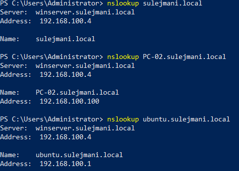

##### Ubuntu Server zu Windows Server und Windows Client
1. root domain: `nslookup sulejmani.local`
2. Windows Client: `nslookup PC-02.sulejmani.local`
3. Windows Server: `nslookup winserver.sulejmani.local`  
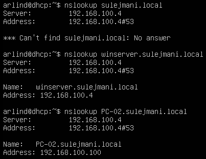
