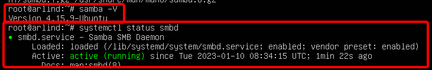
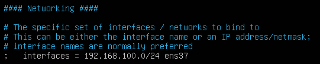
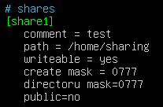
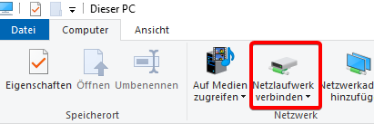
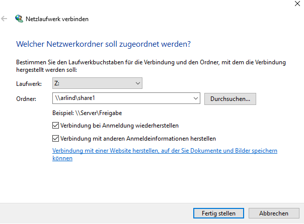

# Samba

## Samba installieren

Bevor man irgend etwas auf Linux macht oder installiert führe zuerst diese 2 Kommandos aus.
1. `sudo apt update`
2. `sudo apt upgrade`

3. Sobald wir dies haben können wir samba installieren `sudo apt install samba -y`
4. Um zu schauen, ob Samba funktioniert können wir einen Samba funkioniert können wir diese 2 Kommandos ausführen:  
`samba -V` `systemctl status smbd`

## Shared Directory erstellen

1. Jetzt erstellen wir ein Directory `sudo mkdir -p /home/sharing`
2. Zum testen, ob dass Verzeichnis erstellt wurde können wir einen `ls /home`
3. `sudo chown nobody:nogroup /home/sharing`
4. `chmod -R 777 /home/sharing`

5. Um das öffnetliche Directory einzustellen müssen wir `sudo vim /etc/samba/smb.conf` oder `sudo nano /etc/samba/smb.conf` ausführen und dort unsere konfiguration ergänzen.

6. Hier müssen wir unseren Adapter angeben.  
  
7. asfasdfs
  

8. `sudo smbpasswd -a arlind`
9. `sudo systemctl restart smbd`

Sobald wir dies haben gehen wir zu unserem Client

