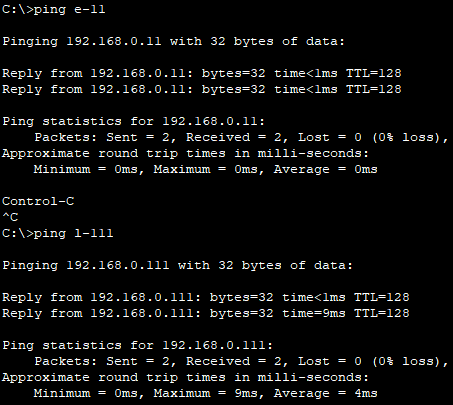
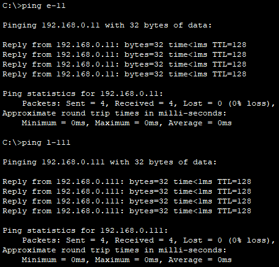

# Cisco Packet Tracer, DHCP & DNS Herausforderung

## Vorlage installieren
Laden Sie hier diese [Datei](https://tbzedu.sharepoint.com/:u:/s/campus/students/ESo0sgUiypJBvgd-nt5MBAoBAgGTFWqtuZCIeoJv9lq1Uw?e=NJ58U9) herunter.

## Ablauf
1. Schalten Sie alle Computer und Server mit den Power-Buttons ein.
2. Verteilen Sie die IP-Adressen aller statischen IP-Geräte nach Namenskonvention und geben Sie den DNS-Server an.
3. Aktivieren Sie im DHCP-Server den DHCP-Dienst und geben Sie die erste IP 192.168.0.150 an.
4. Geben Sie 50 Clients und den DNS-Server an.
5. Aktivieren Sie DHCP für alle statischen Clients.
6. Aktivieren Sie im DNS-Server den DNS-Dienst und erstellen Sie für alle statischen IP-Geräte einen A-Record.

## Testen
Pingen Sie bei allen Clients alle und führen Sie gegebenenfalls einen nslookup durch.

Client mit statischer IP

Client mit DHCP

