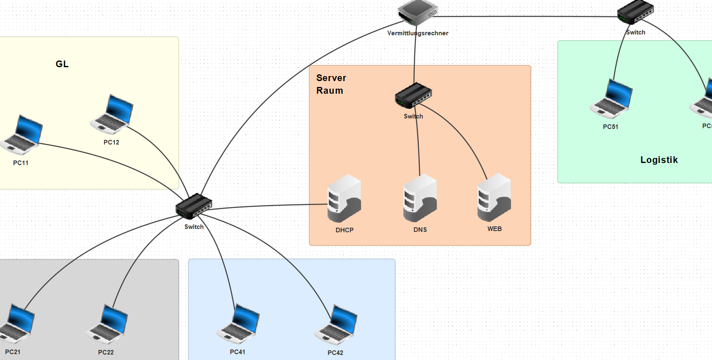
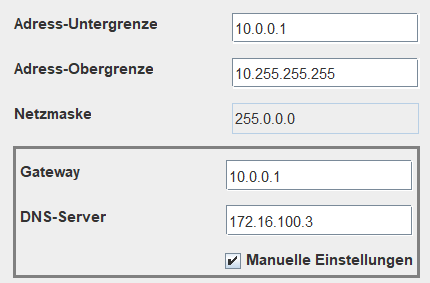

# Filius Netzwerk erstllen mit mehreren Subnetz

## Alle Clients verbinden und die Hostnamen anpassen

Danach geben wir alle fixe IPs an, den Gateway und auch den Gateway.

Jedes Subnetz hat einen eigenen Gateway.

| Subnetz         | Gateway      |
|-----------------|--------------|
| 10.0.0.0/8      | 10.0.0.1     |
| 172.16.100.0/16 | 172.16.100.1 |
| 182.168.1.0/24  | 192.168.1.1  |

## DHCP Server einrichten

Beim DHCP-Server 10.0.0.2 müssen wir den DHCP Server einstellen für die Clients im 10.0.0.0/8 Netzwerk

## DNS Server einrichten

Beim DNS-Server sollten wir den DHCP-Dienst aktivieren, und einen DNS eintrag erstellen, in meinem Fall

172.16.100.3 dns

## Web Server einrichten

Beim Web-Server können wir den Web-Server installieren und den Dienst starten.

## Testen

Um alles zu testen, sollten wir ein paar statische Clients und einen DHCP Client auswählen und versuchen jedes Subnetz zu pingen, und den DNS-Server zu testen und den Web Server aufzurufen mit dem Webbrowser.
